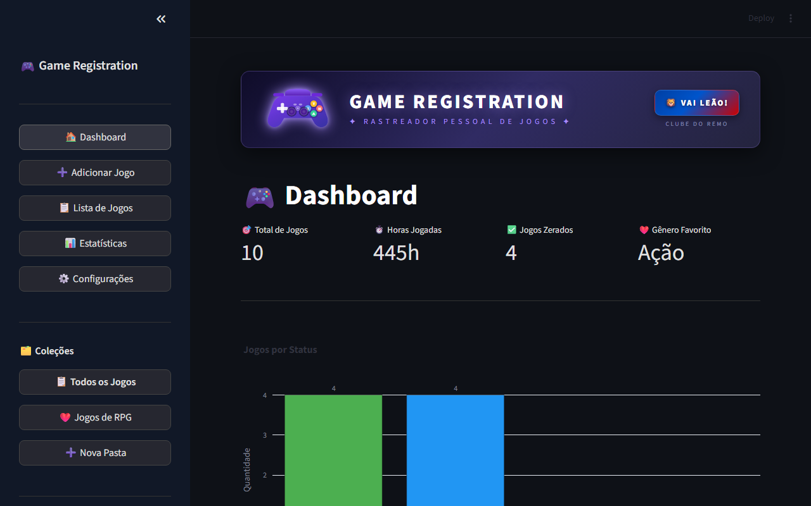
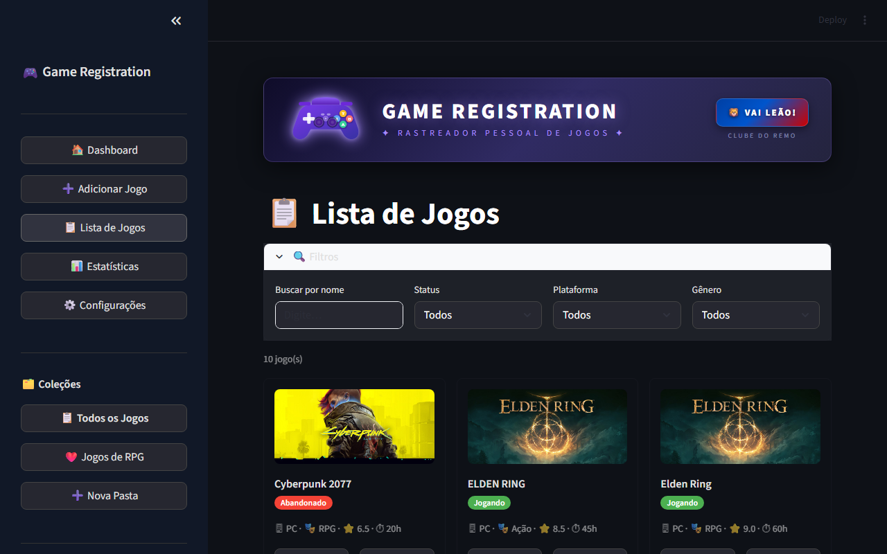
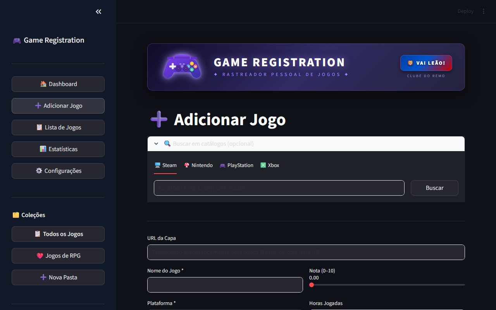
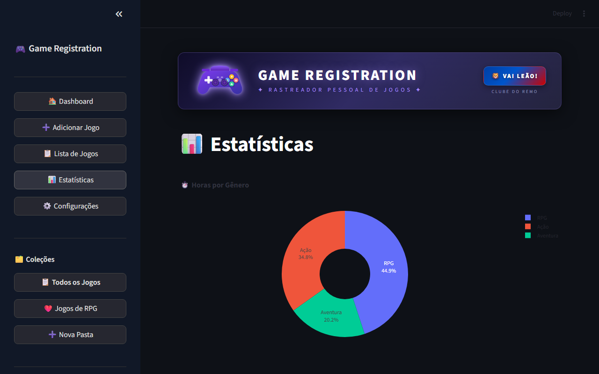

# 🎮 Game Registration

Rastreador pessoal de jogos com contas individuais na nuvem.
Desenvolvido por **Antonio Carvalho — ICMC/USP**.

---

## 🌐 Acesse o app

**👉 [game-registration-b2woiypd4qwyhkj65rxwhj.streamlit.app](https://game-registration-b2woiypd4qwyhkj65rxwhj.streamlit.app/)**

Não precisa instalar nada. Crie sua conta e comece a usar direto no navegador.

---

## 📸 Screenshots

| Dashboard | Lista de Jogos |
|-----------|---------------|
|  |  |

| Adicionar Jogo | Estatísticas |
|----------------|-------------|
|  |  |

---

## ✨ Funcionalidades

- **Login e cadastro** — cada usuário tem sua própria conta e dados isolados na nuvem
- **Dashboard** — métricas gerais: total de jogos, horas jogadas, jogos zerados e gênero favorito
- **Adicionar Jogo** — cadastro com nome, plataforma, gênero, status, nota (0–10), review, datas e horas jogadas
- **Busca automática de capas** — integração com Steam, Nintendo, PlayStation e Xbox
- **Lista de Jogos** — filtros por nome, status, plataforma e gênero; edição e exclusão inline
- **Coleções/Pastas** — organize seus jogos em pastas personalizadas com ícone e cor
- **Estatísticas** — gráficos de horas por gênero, jogos por plataforma, ranking de horas, distribuição de notas e mais
- **Modo escuro/claro** — alternável nas configurações

---

## 🛠️ Tecnologias

| Tecnologia | Uso |
|------------|-----|
| Python 3.10+ | Linguagem principal |
| Streamlit | Interface web |
| Supabase | Banco de dados PostgreSQL na nuvem + autenticação |
| Pandas | Manipulação de dados |
| Plotly | Gráficos interativos |
| Requests | Integração com APIs (Steam, RAWG) |

---

## 💡 Observação

Cada conta tem seu próprio banco de dados isolado.
Seus jogos ficam salvos na nuvem e acessíveis de qualquer dispositivo.
